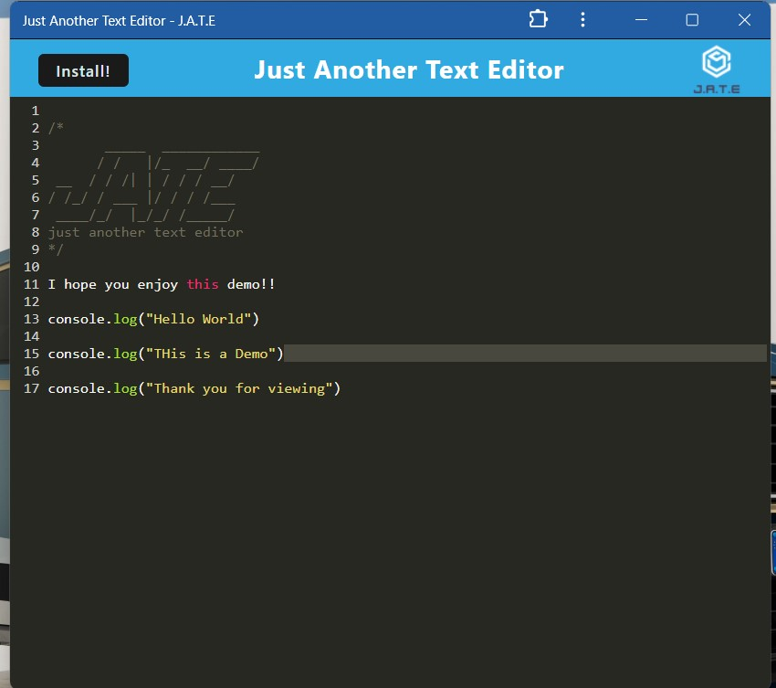

# PWA Text Editor

## Description

This project is a Progressive Web Application (PWA) text editor that runs in the browser. The app is designed as a single-page application (SPA) that meets the criteria of a PWA, providing a seamless user experience both online and offline. The text editor leverages IndexedDB for data persistence, ensuring that users' content is saved and retrievable even without an internet connection. The application can also be installed on the user's device, offering native app-like functionality.

### Features

- **Offline Capability**: The application functions offline, allowing users to create and save notes or code snippets without an internet connection.
- **IndexedDB Integration**: Uses IndexedDB to store data, ensuring content is saved locally and persists across sessions.
- **Service Worker**: Utilizes a service worker to cache static assets, enhancing load times and offline functionality.
- **PWA Installable**: Users can install the application on their devices for a native app-like experience.
- **Webpack Bundling**: JavaScript files are bundled using Webpack, optimizing the application's performance.
- **Babel Transpilation**: Uses Babel to enable modern JavaScript features, including async/await.

## Usage

To use the application, follow these steps:

1. **Start the Application**: Run the application locally by executing `npm run start` in the root directory.
2. **Open in Browser**: Navigate to `http://localhost:3000` in your web browser.
3. **Interact with the Text Editor**: Use the text editor to create, edit, and save notes or code snippets. The content will automatically save to IndexedDB.
4. **Offline Use**: The application will continue to function and save content even when there is no internet connection.
5. **Install the PWA**: Click the install button in the browser's address bar to install the application on your device.

## Video Preview

## Screenshot

## Technologies Used

- **Node.js**: JavaScript runtime environment for the backend.
- **Express**: Web framework for Node.js.
- **IndexedDB**: Browser database for storing large amounts of structured data.
- **Webpack**: Module bundler for JavaScript.
- **Workbox**: Library for managing service workers.
- **Babel**: JavaScript compiler to use modern JavaScript features.
- **Render**: Cloud platform for deploying web applications.

## License

This project is licensed under the MIT License.

---

## Author

Developed by [Ralph Molu](www.linkedin.com/in/ralph-molu)

